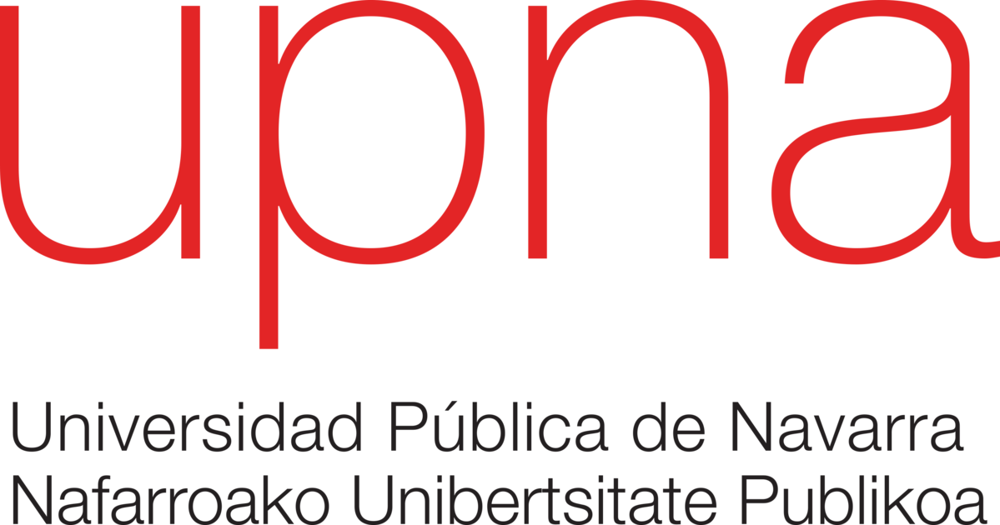

## uav-radio
UAVRadio: Radio Link Path Loss Estimation for UAVs Python Module

# Introduction
The **UAVRadio** Python module is a comprehensive toolkit designed to facilitate the analysis and prediction of radio signal path loss in UAV communication scenarios. This module encompasses a range of path loss models referenced from established literature, offering users a powerful and flexible framework for estimating signal attenuation in UAV communication links. It is a versatile tool for optimizing UAV communication systems and ensuring reliable wireless connectivity in a variety of operational scenarios.

For full documentation, examples and learning how to use the module, please refer to: <a href="http://51.91.59.240/docs_dani/setup/">Official documentation</a>

### Aim and Objectives
The primary aim of this module is to provide engineers, researchers, and enthusiasts in the field of UAV communications with a robust set of Python functions that enable accurate and efficient estimation of radio signal path loss. This capability is essential for various applications, including but not limited to:

1. **Drone Communication Planning:** UAVs often rely on wireless communication for control, telemetry, and data transmission. Accurate path loss estimation is crucial for planning communication range and reliability.
2. **Environmental Analysis:** Different environments, such as urban, rural, and hilly terrain, can significantly affect signal propagation. This module allows users to model and assess path loss under diverse conditions.
3. **Frequency Selection:** For optimal performance, UAV communication systems may operate at various frequencies. This module aids in selecting suitable frequencies by predicting path loss characteristics.

### Key Features
The **Radio Link Path Loss Estimation for UAVs** module includes the following key features:

- **Implementation of Multiple Path Loss Models:** This module offers a selection of well-established path loss models, including Free Space Path Loss, Log-Distance Path Loss, Two-Ray Path Loss, Dual Slope Path Loss, and more. Users can choose the model that best suits their specific UAV communication scenario.
- **Environmental Considerations:** Some path loss models account for environmental factors such as terrain type, foliage intensity, and water bodies. These considerations enhance the accuracy of path loss predictions.
- **Conversion Utilities:** The module provides methods to convert between 2D and 3D positions, calculate distances, and perform coordinate transformations. These utilities assist users in preparing input data for path loss estimation.
- **Contour Plot Generation:** Users can visualize path loss variation across a specified area by generating contour plots centered around transmitter coordinates. These plots aid in understanding signal strength distribution in the UAV communication region.
- **Customization and Extensibility:** The module allows users to customize parameters within path loss models and easily extend it with new models as needed.

### Usage Scenario
Consider a scenario where an engineer needs to plan the communication range for a UAV operating in a densely forested area. By leveraging this module, the engineer can select the Log-Distance Path Loss model, adjust parameters based on the foliage intensity, and visualize the path loss distribution using contour plots. This valuable insight informs decisions regarding antenna placement, transmission power, and communication protocols for the UAV.

## Licensing
The **Radio Link Path Loss Estimation for UAVs** Python module is made available under the [MIT License](https://opensource.org/licenses/MIT). You are free to use, modify, and distribute this module in accordance with the terms of the MIT License.

### Reference and Citation
If you use this module for research, please consider citing our paper to acknowledge its contribution:

```bibtex
@article{your_last_name:year,
  author    = {Your Last Name, Your First Name},
  title     = {Title of Your Paper},
  journal   = {Journal Name},
  volume    = {Volume Number},
  number    = {Issue Number},
  pages     = {Page Range},
  year      = {Publication Year},
  doi       = {Your DOI},
  url       = {URL of Your Paper (if available)},
}
```

---



